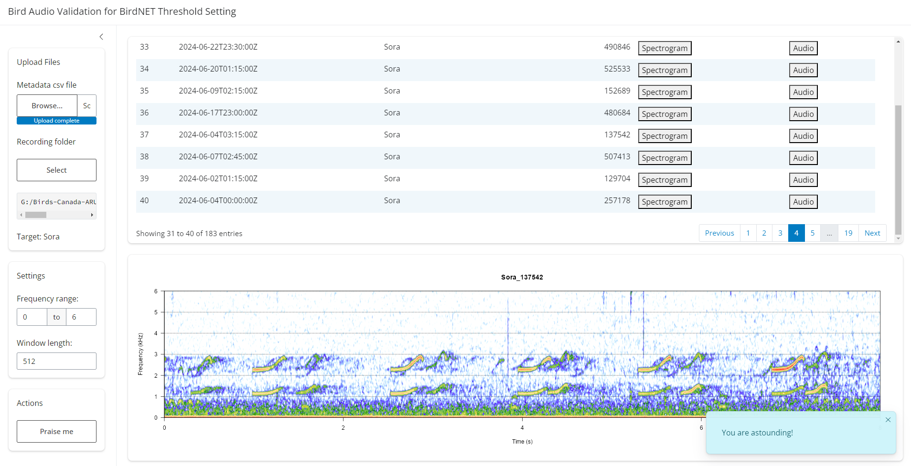

This document provides a detailed, step-by-step guide to the methodology and R code used in our analysis for setting species-specific thresholds for BirdNET, as described in the accompanying publication. By sharing these instructions and code, we aim to facilitate reproducibility and empower researchers to apply these methods to their own datasets.


```r
# set up the library
library(tidyverse)
```

### Step 1: Analyzing audio with BirdNET

Process your audio data using BirdNET. The BirdNET Analyzer, available on their [Github](https://github.com/kahst/BirdNET-Analyzer) page, offers several methods for analysis. Choose the one that best suits your setup:

-   **Windows GUI**: Ideal for users on a Windows operating system, offering a graphical user interface for ease of use.

-   **birdnetR Package**: A convenient option for R users, utilizing the reticulate package to wrap the original Python BirdNET code.

-   **Python**: Recommended for users comfortable with Python, allowing direct use of the BirdNET API or scripts.

### Step 2: Validation

Create a validation dataset by performing stratified sampling on the BirdNET output. In this example, we demonstrate the process using Northern Flicker detections:

1.  **Stratify Confidence Values**: Divide the BirdNET confidence scores into classes ranging from 0.1 to 1, using 0.05 increments.

2.  **Sample Audio Segments**: Randomly select 10 audio segments from each confidence class. This results in a total of 180 audio segments for validation. Notes: In this study, 180 segments were sufficient given our study's scale. We recommend users evaluate their specific data and requirements to determine the appropriate number of segments for robust validation.

This stratified sampling ensures an even distribution of confidence values in the validation dataset, providing a representative sample for assessing threshold.


```r
# read in the output from BirdNET
birdnet_output <- read_csv("birdnet_full.csv")

# select the target species and create a validation dataset
NOFL_validation <- birdnet_output %>%
  filter(common_name == "Northern Flicker") %>%
  mutate(class = cut(x = confidence, breaks = seq(0.1, 1, 0.05))) %>%
  slice_sample(n = 10, by = class)
```

(Optional) To validate BirdNET’s predictions, visually or aurally confirm whether each prediction is a True Positive (TP) or a False Positive (FP). This involves listening to the audio segments and examining their spectrograms. To streamline the process, we developed a BirdNET Validation ShinyApp, which integrates audio playback and spectrogram visualization for efficient review. Refer to the [Github page](https://github.com/SunnyTseng/BirdNET_validation) for detailed usage:


```r
# use install.packages("PACKAGE_NAME") if you don't have the following required packages installed yet
library(shiny) 
library(bslib)
library(shinyWidgets) 
library(shinyFiles)

library(tidyverse)
library(DT)
library(praise)

library(tuneR)
library(seewave)

shiny::runGitHub("BirdNET_validation", "SunnyTseng")
```



We used a validated Northern Flicker dataset to demonstrate the following process. The audio data were collected from the John Prince Research Forest in interior British Columbia, Canada.


```r
# edit the path as needed
NOFL_validation_finished <- read_csv("Northern_Flicker_finished.csv")
```

### Step 3: Translating confidence to probability

Apply a logistic regression model to convert BirdNET confidence scores into probabilities, This step establishes the relationship between BirdNET's confidence scores and the validated outcomes (True Positive or False Positive).


```r
# fit logistic model using glm()
NOFL_model <- glm(observed ~ confidence, 
                  data = NOFL_validation_finished, 
                  family = binomial)
```


```
## `geom_smooth()` using formula = 'y ~ x'
```

<!-- --> 

### Step 4: Establishing threshold relationships with precision

This step calculates how different confidence thresholds influence precision and the proportion of data retained. Using the logistic regression model, we predict probabilities for all BirdNET outputs, then calculate precision and the remaining data for each threshold.


```r
# find precision given a threshold
threshold2precision <- function(probability_data, threshold){
  threshold <- probability_data %>%
    filter(confidence > threshold) %>%
    pull(probability) %>%
    mean()
}


# find the data ramained given a threshold
threshold2remain <- function(probability_data, threshold){
  remain <- probability_data %>%
    filter(confidence > threshold) %>%
    nrow()
  
  remain/nrow(probability_data)
}


# read the full BirdNET output file
birdnet_output <- read_csv("birdnet_full.csv")

# predict probabilities for Northern Flicker data
NOFL_probability <- birdnet_output %>%
  filter(common_name == "Northern Flicker") %>%
  mutate(probability = predict(NOFL_model, newdata = ., type = "response")) 

# create a table of thresholds with precision and data retention
threshold_table <- tibble(threshold = seq(0, 1, 0.001)) %>%
  mutate(data_remained = map_dbl(.x = threshold, 
                                 .f =~ threshold2remain(NOFL_probability, .x))) %>%
  mutate(precision = map_dbl(.x = threshold, 
                             .f =~ threshold2precision(NOFL_probability, .x)))
```


```
## tibble [1,001 x 3] (S3: tbl_df/tbl/data.frame)
##  $ threshold    : num [1:1001] 0 0.001 0.002 0.003 0.004 0.005 0.006 0.007 0.008 0.009 ...
##  $ data_remained: num [1:1001] 1 1 1 1 1 1 1 1 1 1 ...
##  $ precision    : num [1:1001] 0.684 0.684 0.684 0.684 0.684 ...
```

### Step 5: Determining threshold given desired precision

To identify the confidence threshold required to achieve a specified level of precision, we employed a generalized linear model (GLM) with a binomial link function. This approach estimates the relationship between confidence thresholds and precision, enabling the calculation of thresholds for any desired precision level.


```r
# function to determine the threshold given specified precision level
precision2threshold <- function(threshold_table, precision){
  model <- glm(precision ~ threshold, 
               data = threshold_table,
               family = binomial)
    
  (log(precision/(1 - precision)) - model$coefficients[1])/model$coefficients[2]

}
```

Using this method, we determined thresholds corresponding to precision levels of 0.9, 0.95, and 0.99. These thresholds were visualized (red for 0.9, blue for 0.95, and green for 0.99) alongside the precision-threshold relationship.


```r
# thresholds for precision = 0.9 (red), 0.95 (blue), and 0.99 (green)
t_0.9 <- precision2threshold(threshold_table, 0.9)
t_0.95 <- precision2threshold(threshold_table, 0.95)
t_0.99 <- precision2threshold(threshold_table, 0.99)


# visualization of precision vs. threshold
ggplot(threshold_table, aes(x = threshold, 
                            y = precision)) +
  geom_line(stat = "smooth",
            method = "glm", 
            se = FALSE, 
            method.args = list(family = binomial),
            linewidth = 1.5) +
  geom_vline(xintercept = t_0.9, colour = "red", linewidth = 1.5) +
  geom_vline(xintercept = t_0.95, colour = "blue", linewidth = 1.5) +
  geom_vline(xintercept = t_0.99, colour = "darkgreen", linewidth = 1.5) +
  ylim(0, 1) +
  theme_bw() +
  labs(x = "Threshold", 
       y = "Precision")
```

<!-- --> 

Enjoy using BirdNET! 😃🐦😃


